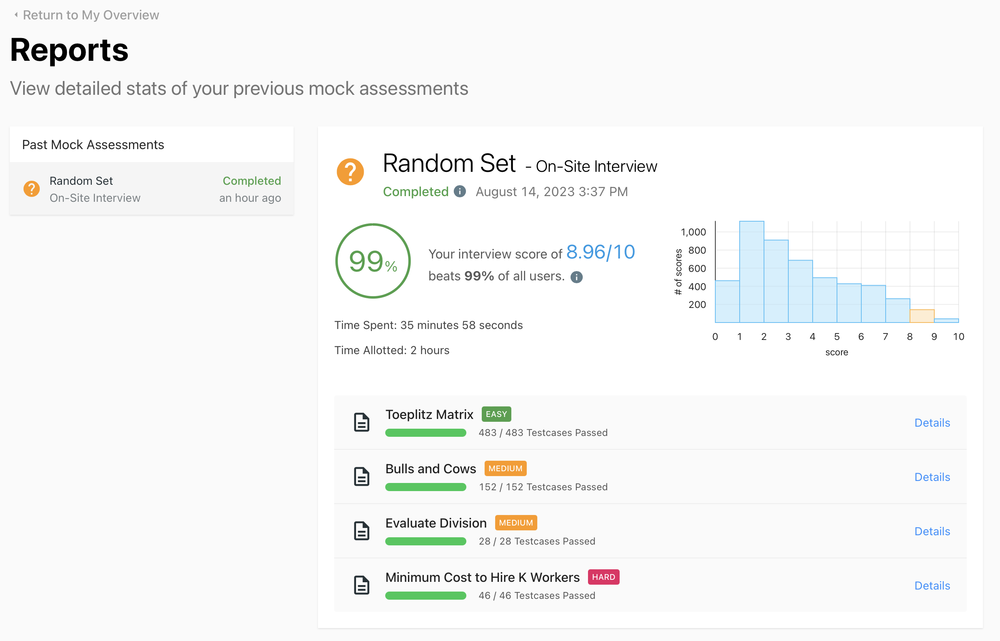

# Some Leetcode Practice

It looks like an era of coding is coming to a pass. LLM aided coding seems to be on the way. I've personally never had the oppuruntity to opperate with punchcards, but I feel like future generations will similiarity think punching in algorithms using modern python syntax to be "barbarian".

## Leetcode Excersize

This was pretty much done with an LLM. 30 of the 35 mintues was me reading and understanding the problem. It honestly could have been done with just copy/paste. Most students in the future probably just need a class that introduces them to the concept, the implementation will be left to the AI.